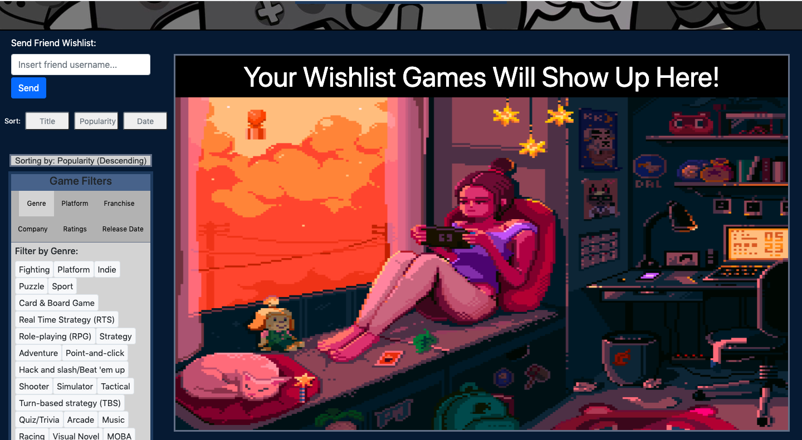
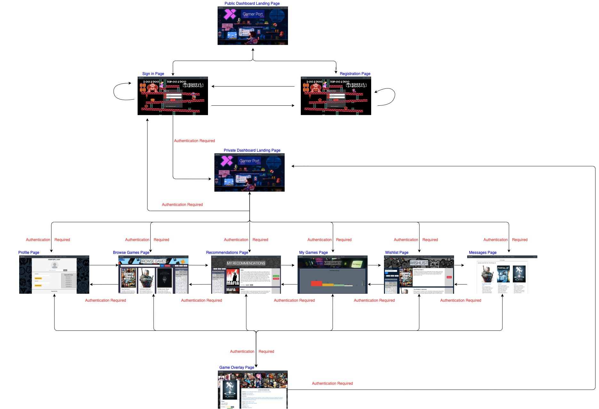

# Gaming Gators
## Gamer Port
* https://gamer-port.herokuapp.com/
### Semester
* Fall 2020

### Overview
    Gamer Port is an innovative web application that allows people to create a digital library of video game ratings. Every person who uses Gamer Port gets a unique profile to create a list to keep track of all the video games they have ever played as well as how they rated those games. Users also can create a wish list to keep track of those games that they are hoping to buy or play in the future. Users can friend one another and send their respective rating list and wish list to keep their friends informed on what they thought of specific games or what games they are dying to play. Each user will also get a personalized recommendation list of games that they may enjoy based on their ratings of other games. Any video game player would find Gamer Port useful for keeping a digital library of their games, keeping a wish list that is easily shared, sharing their ratings of their favorite games with friends, receiving recommendations for them to find their new favorite games, or simply browsing the library of video games across all consoles/pc that Gamer Port has to offer.

### Team Contributers:
* Emily Michaud - emichaud998
* Nicholas Michaud - namichaud
* Timothy Shee - Borghese-Gladiator

### User Interface

#### **Dashboard Page (Public)**

    The above image is a screenshot of the main public dashboard landing page for Gamer Port. This is the default home page a non-signed in user will land on. In the navigation bar, the user can navigate to the registration page, sign-in page, or back to this Gamer Port landing page. 

#### **Dashboard Page (Private)**

    The above image is a screenshot of the main dashboard landing page for Gamer Port once a user is signed in. This is the page a user will be redirected to after successfully signing in, and is the default home page a signed in user will land on. From here we can move freely between all the private game pages of our application through the navigation bar at the top of the page. The user can use the Gamer Port link in the navbar to navigate back to this private dashboard landing page. The user can also hit the log out link in the navigation bar to log out and be redirected back to the sign in page.
 
 

#### **Sign-in Page**

    The above image is a screenshot of the sign in page for Gamer Port. Here, a user can sign in with their username and password to get access to their account. If signing in is successful, the user will be redirected to tha main private dashboard landing page described above. If a user does not have an account yet, they can click the Register link to take them to the registration page.
 
 

#### **Register Page**

    The above image is a screenshot of the registeration page for Gamer Port. Here, a user can create a new account for the application by entering in a unique username and a password. If the user already has an account, they can click the Sign in link to take them to the sign in page.
 
 

#### **Profile Page**

    The above images are screenshots of the Profile webpage. This is the page that displays all the user information for a user and lets him/her change certain things like their username, password, and profile picture as well as configure their friends list. At the top of the page the user's username is displayed with their profile picture below. Below the picture is a textbox where a user can enter a url to a png or jpg file on the internet and click "Update." This will change the profile picture to this new URL picture. Next, there are two text boxes for resetting username and password. User's can set their password to anything, but their username must not be taken by another user. Resetting username will change the username at the top of the page as well. Next to this we have the user stats of how many games the user has rated and the breakdown of their ratings. Finally, we have a friends list where friends can be removed via the "Remove Friend" button and friends can be added by searching their username and clicking "Add Friend."
 
 

#### **Browse Games Page**

    The above images are screenshots of the Browse Games webpage. This is the page where users can browse and search for games to explore, rate, or add games to their wishlist. At the top of the page is a search bar where users can search for games by title. This search bar features autocompletion to help a user better search for the game title they are looking for, in which the user can select one of the autocomplete options that appears as they type to add the title into the search bar. After hitting the "Search" button, all games containing the searched word will appear in the game list below. The "Clear Search" button will reset your browse games back to before you searched. Each game card represents a game which can be rated by clicking on the number of stars the user wants to rate the game, and then hitting the "Submit" button. The game can added to the user's wishlist via "Add to Wishlist" button on each card. Each game card title and image contains a link that can be clicked on to take a user to a game overlay page which gives more information about the game as well as letting the users rate and add to wishlist. On the right side of the webpage is a filter system which allows the user to filter games by genre, platform, franchise, company, ratings, and release date. Clicking "Apply Selected Filters" will filter your game list on the left side of the page by whatever filters the user has selected. Clicking "Clear All Filters" will reverse any filtering a user has done. A user can also search the game list by hovering over either the "Title", "Popularity", or "Date" drop-down buttons on the top right corner of the page, and selecting either "Ascending" or "Descending" to sort the game list by that drop-down button title in either the ascending or descending order. This page also features a paging bar at the bottom of the page in which a page number can be clicked on to navigate through each page of games. 
 
 

#### **Recommendations Page**

    The above images are screenshots of the recommendations page for Gamer Port. Here, users will be given a list of recommended games generated using the themes and genres of the games they have rated the most stars. As an example, in these images the user has rated racing games the highest number of stars, and thus their recommendation list mostly contains racing games. Users can filter and sort their recommendations similarily to how they can on the browse games page described above. Users can also use the buttons on each game card to either add to wishlist by clicking on the "Add to wishlist" button, or remove from their recommendations list by clicking on the "Not interested" button. Both of these buttons remove the game from the recommendation list, with the wishlist button adding the game to the user's wishlist instead, and the not interested button adding the game to a list of not interested games for that user, ensuring that game will not get recommended to that user again. Users also have the option to rate games in recommendations in case a game is recommended to them that they have already played and want to rate. Users can click on each game card image or title to bring up an overlay that has more information about that game. The last image shows the recommendations page when all the games have been removed from the recommendations list via the "Add to wishlist" or "Not interested" button, notifying the user that they can refresh the page to recieve more recommendations.
 
 

#### **My Games Page**

    The above image is the Rated Games webpage. This is the page where a user can view all the games they have already rated and view statistics on how they rated their games. At the top of the page there is a bar graph that calculates the percentage of games a user rates 1-5 stars (Terrible-Amazing). Below the graph, a user can view all of their rated games. Users can use the search bar and search for games like the Browse Games webpage described above. The autocomplete for the search bar on this page only contains autocomplete suggestions for games that exist in the user's list of rated games. The "Search" button allows a user to search for their rated games that contain the title they have entered, and the "Clear Search" button will clear the search and revert the list of shown games back to the user's full rated games list.  There is also a filtering sidebar that is identical to the one on the Browse Games Page, and can be used to filter the user's rated games. Users can sort their rated games similarily to how they can on the browse games page described above using the sorting drop down buttons. Games in the rated games list can be re-rated via the star system and with the "Submit" button on each game card. If a game is re-rated to 0 stars, it will automatically be removed from the rated games list. Every game card has a link in their image and title that can be clicked on which leads to their correlating game overlay page. The page also features a search bar that can be used to type in one of the user's friends in their friendlist (features autocompletion to help user type in friend usernames). The "Share" button can be pressed by the user after typing in a friend username in order to send their current rating list to their friends in a message. The last image shown shows the rated games page game list when no games have been rated yet. 
 
 

#### **Wishlist Page**

    The above images are the Wishlist webpage. This is the page that displays the games stored in the user's wishlist. These are the games that have been added to the user's wishlist via "Add to Wishlist" buttons on the Browse Games page, Recommendations page, or the Game Overlay page. The game cards here also can lead to a game's overlay page via links in the game's cover image and title. Each game card on this page features a "Remove" button which removes that game from the user's wishlist. The wishlist page also has a send feature that can be used by a user to send their wishlist to their friends. A user only needs to type in the username of a friend in the searchbar (features autocompletion to help user type in friend username) and click the button "Send" to send a message containing the wishlist to their friend's account. Just like the Rated Games and Browse Games pages, there is a filtering sidebar here that can filter the wishlist games by many categories, and the drop-down sorting buttons can be used to sort the games in the wishlist. The last image shown shows the wishlist page game list when no games have been added to the user's wishlist yet. 
 
 

#### **Messages Page**

    The above images are screenshots of the Messages Page. This is the page where users can view the messages sent from their friends. Each message has a title that tells the user who the message was sent by, and what type of list they sent (either their wishlist or ratings list). The body of the message displays either the sender's wishlist or ratings list. In the case of the ratings list (shown in screenshot 2), the list of games shown contains the rating the sender has rated those games. Each of the games shown in the sent wishlist/rating list contains links in the game cover images and game titles that will navigate the user to the game's Game Overlay page, where the user can see more information about the game, rate the game, and/or add the game to their own wishlist. Every message card also has a red trash icon to allow users to delete individual messages from their message list inbox. The first image shown shows the messages page when the user does not have any messages in their inbox.
 
 

#### **Game Overlay Page**

    The above images are screenshots of the game overlay page. This page can be accessed for any game via the links on each game card's image or game title. The game overlay page will open upon clicking any of these game card links found on the browse games, my game ratings, wishlist, recommendation, and messages pages. This page holds key information about each game, including a game cover image, the title, the main developer company, and the release year of the game. The page holds additional information about what platforms the game can be played on, the company(s) that made the game, a description of the game, the genre(s) of the game, the theme(s) of the game, the series the game is a part of, the franchise(s) the game contains, different game modes the game supports, and the player perspective of the game. This page also has a scrollable section that displays screenshots from the game. A user can also see the rating they have given the game on this page or submit a new rating, and they can add the game to their wishlist via the "Add to Wishlist" button.
 
 

 

### API Endpoints (POST)
 

#### **/user/login**

    This endpoint takes in a username and password and logs in the user that those two credentials represent if they are valid. If valid, redirects the user to their private dashboard page, otherwise redirects the user back to log in page.
 
 

#### **/user/register**

    This endpoint takes in a username, and password and registers a new user with those credentials as long as the username is not already in use.
 
 

#### **/user/username/update**

    This endpoint takes in a new username that the current user wants to update their username to. It then updates that user's username in the database unless that new username is already taken. The user can update their username with the reset username textbox on the profile page.
 
 

#### **/user/password/update**

    This endpoint takes in a userID or username or both as well as a new password in order to reset the password for the user whose userID it is. The user can choose their password with the reset password textbox on the profile page.
 
 

#### **/user/profilepicture**

    This endpoint takes in a userID and gets the corresponding profile picture for the user with that userID.
 
 

#### **/user/profilepicture/update**

    This endpoint takes in a url to a png, or jpg file in order to set the current user's profile picture as a new picture found on the web by storing the URL in the database. A user can do this by entering a URL in the set profile picture textbox on the profile webpage.
 
 

#### **/user/username**

    This endpoint takes in a userID and returns the username of the user that corresponds with that userID if and only if that userID is valid.
 
 

#### **/user/userID**

    This endpoint takes in a username and returns the userID of the user that corresponds with that username if and only if that username is in use by some user
 
 

#### **/user/friends/add**

    This endpoint takes in a friend ID to be added the current user’s friend list. It adds both users to each other's friend lists if the friend ID is valid and both users are not already friends.
 
 

#### **/user/friends/remove**

    This endpoint takes in a friend ID to be removed from the current user’s friend's list. It removes both users from each other's friend list in the database.
 
 

#### **/user/ratings/info**

    This endpoint returns a list of game objects containing information for each game in the current user’s list of rated games. It takes in a sorting object that indicates how the list of game objects should be sorted.
 
 

#### **/user/ratings/update**

    This endpoint takes in a rating score and a gameID in order to add a new rating for that corresponding game to the current user's rating list. If the game is already in the user’s ratings list, it will update that game’s rating to the new rating that is passed in. It will only add/update the user’s rating list if the gameID is valid.
 
 

#### **/user/ratings/remove**

    This endpoint takes in a gameID in order to remove the rating corresponding to that gameID from the current user's rating list. It will only do this if the gameID is valid and the game is in the signed in user's ratings list.
 
 

#### **/user/wishlist**

    This endpoint returns the wishlist of the currently signed in user. This returned wishlist consists of a list of game objects containing information for each game in the current user’s wishlist. It takes in a sorting object that indicates how the list of game objects should be sorted.
 
 

#### **/user/wishlist/add**

    This endpoint takes in a gameID to add to the currently signed in user's wishlist, which is a list of gameIDs. There are many places in the application where you can press add to wishlist buttons to add games to your wishlist.
 
 

#### **/user/wishlist/remove**

    This endpoint takes in a gameID to remove from the currently signed in user's wishlist. A game will only be successfully removed from the user’s wishlist if the passed in gameID is valid and is in the user’s wishlist. A user can accomplish this by clicking on the Remove button on any game card on the wishlist page when their wishlist is not empty.
 
 

#### **/user/recommendations**

    This endpoint returns the recommendation list of the currently signed in user, running a recommendation algorithm to create this list of recommended games based on the user’s ratings. This returned recommendation list consists of a list of game objects containing information for each game in the current user’s recommendation list. It takes in a sorting object that indicates how the list of game objects should be sorted.
 
 

#### **/user/recommendations/remove**

    This endpoint takes in a gameID to remove a from the current user's recommendation list. This is done by the user by clicking the Not Interested button on the recommendations page. This is only successful if the game to be removed is in the user's recommendations list.
 
 

#### **/games/list/info**

    This endpoint takes in an array of custom game lists from recommendations or wishlist and returns all of the game information from each game in that list. This includes gameID, game cover, game name, game genre, game platform, and more for each game in the list.
 
 

#### **/user/messages/remove**

    This endpoint takes in a messageID to remove the message corresponding to that messageID from the current user's message list. This is successful only if the messageID is in the current user’s message list.
 
 

#### **/messages/send**

    This endpoint takes in a friend username and a game list to send in a message from the currently signed in user to the friend corresponding to the friend username that is passed in. This endpoint creates a message containing a unique messageID, a message title that contains the user’s name and the type of list they are sending, and a message body containing the user’s game list they want to send. It then stores the message in the friend’s message list. This will only work if both users are friends with each other.
 
 

#### **/games/singleGame**

    This endpoint takes in a gameID and returns a game object containing all the information about the game that shares that gameID.
 
 

#### **/games/allGames**
    This endpoint returns a list of game objects containing information for each game for every stored game in the database. It takes in a sorting object that indicates how the list of game objects should be sorted.
 
 

#### **/game/list/filter/all**

    This endpoint takes in a list of filtering criteria for each filter type (genre, platform, franchise, company, release year, release decade), a rating filter object to filter by rating, and a sorting object that indicates how the list of game objects should be sorted. Using all the filtering criteria that is passed in, a SQL filter string is created in order to filter all games in the database by all the filters passed in. This endpoint then returns a list of game objects containing information for each game in this filtered game list.
 
 

#### **/game/list/filter/custom**

    This endpoint takes in a list of filtering criteria for each filter type (genre, platform, franchise, company, release year, release decade), a rating filter object to filter by rating, and a sorting object that indicates how the list of game objects should be sorted. This endpoint also takes in a userTableType string that indicates whether the currently signed in user’s wishlist or ratings list should be filtered and returned. Using all the filtering criteria that is passed in, a SQL filter string is created in order to filter the user’s wishlist/rating list by all the filters passed in. This endpoint then returns a list of game objects containing information for each game in this filtered game list.
 
 

#### **/game/list/Search**

    This endpoint takes in a titleSearch string which contains the string the currently signed in user has searched by, and returns a list of games objects containing that titleSearch string in their title. It also takes in a sorting object that indicates how the list of game objects should be sorted.
 
 

#### **/game/search/filter**

    This endpoint takes in a list of filtering criteria for each filter type (genre, platform, franchise, company, release year, release decade), a rating filter object to filter by rating, and a sorting object that indicates how the list of game objects should be sorted. This endpoint also takes in a searchList, which contains a list of gameIDs that were returned in a previous search. Using all the filtering criteria that is passed in, a SQL filter string is created in order to filter all games in the database by all the filters passed in, while only including the games whose IDs are in the searchList. This endpoint then returns a list of game objects containing information for each game in this filtered game list.
 
 

### API Endpoints (GET)
 

#### **/games/allTitles**

    This endpoint returns a list of all the game titles of every game in the database.
 
 

#### **/games/allGenres**

    This endpoint returns a list of all the distinct game genre names in the database.
 
 

#### **/games/allPlatforms**

    This endpoint returns a list of all the distinct platform names in the database.
 
 

#### **/games/allFranchises**

    This endpoint returns a list of all the distinct franchise names in the database.
 
 

#### **/games/allCompanies**

    This endpoint returns a list of all the distinct game developer company names in the database.
 
 

#### **/games/allReleaseYears**

    This endpoint returns a list of all the distinct release years of all games in the database.
 
 

#### **/user/logout**

    This endpoint handles the logging out of the currently signed in user and redirects the signed out user back to the login page.
 
 

#### **/user/profile**

    This endpoint returns the full profile information for the user that is currently signed in. The profile includes the user’s userID, username, and profile picture.
 
 

#### **/user/friends**

    This endpoint returns the corresponding friends list for the user that is currently signed in. This friends list is a list of every friend’s userID.
 
 

#### **/user/friends/allUsernames**

    This endpoint returns a list of all the usernames in the current user’s friend list.
 
 

#### **/user/ratings**

    This endpoint returns a list of all the game IDs and their corresponding rating scores in the current user’s list of rated games.
 
 

#### **/user/ratings/allTitles**

    This endpoint returns a list of all the game titles from the currently signed in user's ratings list.
 
 

#### **/user/messages**

    This endpoint returns the messages list that corresponds to the currently signed in user. This message list contains a list of message objects that contain a messageID, title, and message body containing the sender’s wishlist/rating list. 
 
 

### Database
 

#### Games Table
| Column              | Data Type | Description                                                        |
|---------------------|-----------|--------------------------------------------------------------------|
| id                  | integer   | unique id for game                                                 |
| name                | varchar   | title of game                                                      |
| description         | varchar   | description of game                                                |
| cover               | varchar   | filepath of cover art picture                                      |
| release_date        | date      | date game was released                                             |
| follows             | integer   | number of people following game                                    |
| rating_count        | integer   | number of people who rated game                                    |
| rating_average      | decimal   | average rating score for game                                      |
| screenshots         | varchar   | filepath of screenshots for game in stringifyied array             |
| genre               | varchar   | games' genre(s) in stringifyied array                              |
| platform            | varchar   | games' platform(s) in stringifyied array                           |
| publisher           | varchar   | games' publisher(s) in stringifyied array                          |
| developer           | varchar   | games' developer(s) in stringifyied array                          |
| franchise           | varchar   | franchise the game belongs to in stringifyied array                |
| series              | varchar   | series the game belongs to                                         |
| game_modes          | varchar   | singleplayer, splitscreen, multiplayer, etc. in stringifyied array |
| themes              | varchar   | games' themes in stringifyied array                                |
| similar_games       | varchar   | ids for games that are similar to this one in stringifyied array   |
| player_perspectives | varchar   | first person, third person, etc. in stringifyied array             |
| alternative_names   | varchar   | other names for this game in stringifyied array                    |

 

    The games table is a table that holds all of the information about every game in the database. Every game has a unique id for identifying the game, a title, a description, cover art and screenshots, genre, themes, and more. This table is used to create the game cards and the game overlay webpage. The genres and themes information is used for finding recommendations on the recommendations webpage. The filters in the application also use this table extensively to give the user the games they are asking for with specific criteria. Altogether, this table contains all the information for each game in our application.

 

#### users Table
| Column              | Data Type | Description                                         |
|---------------------|-----------|-----------------------------------------------------|
| id                  | SERIAL    | unique id for user that is given in ascending order |
| username            | varchar   | username for user                                   |
| password            | varchar   | users hashed password                               |
| salt                | varchar   | salt for password confidentiality                   |
| profilePicture      | varchar   | url/pathname for user's profile picture             |

 

    The users table is a table that holds all of the information about every user in the database. When a user registers, they are given a unique id. The username and password they registered with can be used to sign in. The password is saved as a hash of the actual password with a salt added to the end. For authentication this means for a user to login, the salt must be appended to their password and then hashed to check if the password matches the hash in the password column for that user. The profile page is saved as a path to a default picture when the user first makes their account. This picture can later be changed on the profile webpage with a URL to a png or jpg file. The username and password can also be changed on the profile webpage.

 

#### user_wishlists Table
| Column              | Data Type | Description                              |
|---------------------|-----------|------------------------------------------|
| userID              | integer   | user id with this game in their wishlist |
| gameID              | integer   | game id that is in this user's wishlist  |

 

    The user_wishlists table is a table that matches a userID with a gameID if that gameID is in the user's wishlist. This table is used to render the cards that are supposed to appear on the wishlist webpage. On this webpage wishlist games can be removed from the wishlist which deletes this matching in the database. Any game cards in the application can be added to a user's wishlist. This table is also used to make sure that no wishlist games show up in your recommendations page.

 

#### user_ratings Table
| Column              | Data Type | Description                |
|---------------------|-----------|----------------------------|
| userID              | integer   | user id who did the rating |
| gameID              | integer   | game id that was rated     |
| rating              | integer   | the rating given           |

 

    The user_ratings table contains all the games that users rate from 1 to 5 stars. If a user rates a game 3 stars for example, the uses's id is put in userID, the game's id is put in gameID and the rating 3 is put into rating. This table is used to show the games webpage which shows all your ratings which you can filter by. It is also used in the stats box on the profile page and the bar graph on the games webpage. This table in the database is also used to recommend games that share genres and themes with your highest rated games.

 

#### user_recommendations Table
| Column              | Data Type | Description                            |
|---------------------|-----------|----------------------------------------|
| userID              | integer   | user id who has this recommended game  |
| gameID              | integer   | game that is being recommended to user |

 

    The user_recommendations table contains all recommended games for a user. This table is constantly emptied and remade every time a user clicks on the recommendations page. This is because recommendations change based on how and what games you rate. If you rate a racing game 4 stars then the racing genre gets 4 points. Whatever genres/themes have the most points, the more games in that genre/theme that get put in the recommendations table for that specific userID.

 

#### user_friends Table
| Column              | Data Type | Description              |
|---------------------|-----------|--------------------------|
| userID              | integer   | user's id                |
| friendID            | integer   | friend's id              |

 

    The user_friends table contains all users that are friends with eachother. This means that every matching of friends is in this table twice where the userID and friendID are swapped. On the profile page, a user can type in a username of another user and add them as a friend. This adds the user with that username to the current user's friend list and adds the current user to that username user's friendlist. This also means that when a friend is removed, both users are removed from eachother's friend list. The friend's list is used to send messages containing wishlists or ratings that you may want to share with friends.

 

#### user_ignore Table
| Column              | Data Type | Description                   |
|---------------------|-----------|-------------------------------|
| userID              | integer   | user id who ignored this game |
| gameID              | integer   | game id that was ignored      |

 

    The user_ignore table is only used for the recommendation algorithm on the recommendation webpage. When a user scrolls through their recommendations they will be given the choice to add a game to their wishlist, or ignore it. If they choose the latter, the game is put into this table with that current user's userID. Next time the recommendations page is loaded, this game will be excluded from the list.

 

#### user_messages Table
| Column              | Data Type | Description                                                       |
|---------------------|-----------|-------------------------------------------------------------------|
| userID              | integer   | user id who received the message                                  |
| messageID           | SERIAL    | unique identified of message in ascending order                   |
| title               | varchar   | title of the message- contains sender username and game list type |
| message             | varchar   |  contents of the message- contains sender game list               |

 

    The user_messages table contains all the information for individual messages sent to user's. These messages have a unique id, a title, and a body(message in the db). When the messages page is opened, this table is used to grab all messages that the current user has matched with them. These messages usually contain wishlists or rating lists sent by the user's friends. Messages can also be deleted from this table on the messages page by clicking the appropriate button.

 

### URL Routes/Mappings

| Starting Page|Destination Page|Require Authentication|Description|
|--------------------------|---------------------------|------|-------------------------------------------------------------------|
| --- | Public Dashboard Landing | No   | Main page non-signed in user lands on. Non-signed in users can navigate to page using GamerPort URL link in Navigation bar |
| Public Dashboard Landing | Sign-in  | No   | Non-signed in users can navigate to destination page using Sign In URL link in Navigation bar in order to sign in to application |
| Public Dashboard Landing | Registration  | No   | Non-signed in users can navigate to destination page using Register URL link in Navigation bar in order to register an account for application |
| Registration | Public Dashboard Landing  | No   | Non-signed in users can navigate back to main public landing page using GamerPort URL link in Navigation bar|
| Registration | Sign-in  | No   | Non-signed in users can navigate to destination page using Sign in URL link in Navigation bar or "Have an account? Sign in" link in order to sign in to application. Users will be automatically redirected to sign in page after successful registration|
| Registration | Registration  | No   | Unneccessful registration due to already used username will redirect user back to registration page|
| Sign-in | Public Dashboard Landing | No   | Non-signed in users can navigate back to main public landing page using GamerPort URL link in Navigation bar |
| Sign-in | Registration  | No   | Non-signed in users can navigate to destination page using Register URL link in Navigation bar or "Don't have an account? Register" link in order to register an account for application |
| Sign-in | Sign-in  | No | Unneccessful sign in due to incorrect username/password will redirect user back to sign in page|
| Sign-in | Private Dashboard Landing  | Yes | Successful sign in will redirect user to main private dashboard page for signed in users. This dashboard page includes a navigation bar that allows the signed in user to navigate through all the private user pages|
| --- | Private Dashboard Landing | Yes | Main page signed in user lands on. Non-signed in user will be redirected to the public dashboard page. Signed in users can navigate to the private dashboard page using GamerPort URL link in Navigation bar. |
| Private Dashboard Landing | Profile, Browse Games, Recommendations, My Games, Wishlist, Messages | Yes | Private Dashboard navigation bar allows signed in users to navigate to any of the destination pages listed. Only signed in users can access these pages, as each of these pages contains user specific information, such as the signed in user's username, profile picture, ratings list, wishlist, recommendations list, and friends list.|
| Private Dashboard Landing, Profile, Browse Games, Recommendations, My Games, Wishlist, Messages | Private Dashboard Landing, Profile, Browse Games, Recommendations, My Games, Wishlist, Messages | Yes | Navigation bar on private pages allows signed in users to navigate from one user private page to another. These paths can only be accessed by a signed in user. If a non-signed in user tries to access any of these pages, they will be redirected back to the public dashboard landing page |
| Browse Games, Recommendations, My Games, Wishlist, Messages | Game Overlay | Yes | This overlay page can be accessed for any game via the links on each game card's image or game title. The game overlay page will open upon clicking any of these game card links found on the browse games, my game ratings, wishlist, recommendation, and messages pages. This page holds extra information about each game and extra screenshots of the game. This page can only be accessed by signed in users, as it displays/updates user specific information, such as displaying/updating the user's ratings list and updating the user's wishlist |
| Game Overlay | Private Dashboard Landing, Browse Games, Recommendations, My Games, Wishlist, Messages | Yes | The game overlay page contains a navigation bar that allows a signed in user to navigate to any of the private user pages. |
| Private Dashboard Landing, Browse Games, Recommendations, My Games, Wishlist, Messages, Game Overlay | Sign-in | Yes | Any of the private user pages that require a user to be signed in contains a logout link in their navigation bar. This logout link logs out the current user and redirects the user back to the public sign-in page |

 
 
### Authentication/Authorization
    Users are authenticated using Passport when they sign into the application on the sign in page. When a user signs in, passport handles authentication by creating a user object for the currently signed in user. This user object is associated with a unique identifier to handle checking for the specific user object for the user that is signed in when checking for authentication. All the URL routes that navigate to HTML pages found in the client/src/private folder include authentication checks that can only be accessed if a user is currently signed in. The endpoints these pages query use the authenticated currently signed in user object to return the correct information for that user. Upon initial landing of the Gamer Port application, the non-signed in user wil land on a public dashboard page in which the user can only navigate to the sign in page or registration page. Once a user is signed in and authenticated, the user will be navigated to the private dashboard page in which they can now access all the user private pages, including the user's Profile page, Browse Games page, Recommendations page, My Games page, Wishlist page, and Messages page, which all include authentication checks to be accessed. When a user hits the logout link, Passport will handle logging out the user so that they can no longer navigate to the authentication protected private pages. 

 

### Division of Labor
#### Emily Michaud - emichaud998
* Browse Games HTML/CSS
* Recommendations HTML/CSS
* Games HTML/CSS (Ratings)
* Game card overlay HTML/CSS
* Wireframes
* Browse Games Frontend
* Recommendations Frontend
* Games Frontend (Ratings)
* Game card overlay Frontend
* Dummy Server Implementation
* Passport Authentication
* Backend Game Cards
* Backend Filtering
* Backend Browse Games
* Backend Game Overlay Page
* Search Bars Backend
* Fetched IGDB Game Database Information Using Scripts
* Downloaded Game Cover Images Locally
* Heroku Setup
* Final Markdown

#### Nicholas Michaud - namichaud
* Profile HTML/CSS
* Wishlist HTML/CSS
* Games HTML/CSS (Graph)
* Home HTML/CSS
* Wireframes
* Milestone 1 Markdown
* Profile Frontend
* Wishlist Frontend
* Games Frontend (Graph)
* Milestone 2 Markdown
* Login/Register Backend
* Profile Page Backend
* Wishlist Backend
* Ratings Backend
* Recommendations Backend
* Recommendations Algorithm
* Milestone 3 Markdown
* Final Markdown

#### Timothy Shee - Borghese-Gladiator
* Sign In HTML/CSS
* Register HTML/CSS
* Messages HTML/CSS
* Sign In Frontend
* Register Frontend
* Messages Frontend
* Navigation Bar Implementation
* Messages Backend
* Pagination of Browse Games
* Pagination of Messages

### Conclusion
    Altogether, the creation of Gamer Port gave our team invaluable experience designing and implementing a web application from scratch. As we worked on each milestone we progressively got better and better at making our different coding sections work together as one product. Combining HTML, CSS, and JavaScript frontend and backend to create a whole application really showed to us how to put everything together that we have learned in this class. The way we did our milestones was an interesting learning experience because we had to work on each part of the application one step at a time, while always making sure our code for each portion would easily be able to work with the next step of our application implementation. For example, starting with the HTML and CSS, we had to make sure we set up this in a way that would make coding the next step of the application process, coding the front end, as smooth as possible without having to make a lot of changes to our previous work on the HTML. It was also a helpful experience to see how our designs and ideas needed to change as we implemented our application. We came across some difficulties when it came to coding style. Everyone codes differently, and making an efficient application using everyone’s different implementation methods was a challenge. We overcame this problem by learning how each other works so we can more easily understand each team member’s parts they worked on for the application. One thing we wish we knew ahead of time was how big our original application idea really was and how much work it was going to take to implement everything we wanted. We underestimated how much work all the features we wanted to include would take to implement, as we had never done anything like this before, which made getting each milestone done on time more stressful. Another hurdle our team had to overcome was trying to complete the implementation of a large application with many components in such a short period of time, with every team member having different class schedules and workloads. Altogether, it was a great experience for learning how teams work to create full web applications in the real world.
