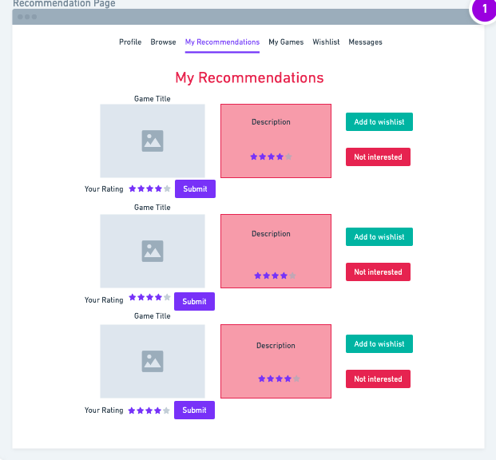

# Milestone 1: Project Wireframe

## Team Name
Gaming Gators

## Web Application Name
Gamer Port

## Team Contributers:
* Emily Michaud - emichaud998
* Nicholas Michaud - namichaud
* Timothy Shee - Borghese-Gladiator

## Innovative Idea:
Our idea is to create an application that will allow users to rate their favorite video games in order to create a personalized profile in which they can share these video game ratings with their friends. The application will use these ratings to generate video game recommendations that the user might be interested in, and it will allow users to add any of these game recommendations to a wish list. As users rate more and more games, their recommendations will become more accurate and personalized to them. Users will be able to leave reviews for games as well, in which other users can then read and reply to. This application is very similar to movie rating websites such as Rotten Tomatoes, but it instead will focus on video games and it will allow users to recieve recommendations based on these ratings. This application is also unique in that it allows users to easily share their recommendations with their friends. It also creates a forum like space that allows video game fans to share and discuss their views and opinions about a variety of different games.

## Important Components:
Our final project will include several different components in order to create an application that will enable video game lovers to rate, share, review, and explore a variety of video games. The application will include a personalized rating system that will be used to generate a library of all the user's video game ratings, and it will generate video game recommendations based on these ratings. The user will be able to navigate to a 'Quick Review' page in which they will be prompted by a variety of random video games that they then must rate on a scale from 1 to 5 stars or select that they have not played that game yet. Any video game they rate will be saved to their private ratings library in which they will be able to see every game they have ever rated. The application will enable users to share any game they have rated with other user's over the application so users can show their friends how they rate certain games. The application will also allow this ratings library to be exported from the application. Using the information collected from the user's ratings of video games containing certain tags, the application will also generate a list of recommended video games for the user. The more quick ratings the user does, the more personalized these recommendations will become. If a user is interested in a recommendation they can add it to their wishlist, and if a user does not like one of the games recommended to them, they can indicate they are not interested and delete the game from their recommendations. There will be a main page with a list of all the application's stored video games that users can browse through. Users will be able to search for specific games in this list that they would like to rate in addition to the rating they can do with the random quick rating functionality. User's will be able to post reviews for these games in the comments for each game, which the other users can then read and reply to. This list will be searchable by game title and filterable by certain video game tags, such as genre, and it will be filterable by ratings and reviews as well. The application will also show the top video game 'tags' that the user seems to enjoy in their profile, which will help the user to know what kinds of tags they might want to filter by on this list.

## Data Interactions

### Sign In
* Sign In will let users access their account if it exists

### Register
* Register will allow users to make a new account

### Profile
* Allows users to reset their username and password
* Allows users to search for other users by usernames and add them to their friend list
* Allows users to review their friend list and remove friends from it

### Browse Games
* Allows users to search for any games in the database
* Allows users to scroll through a random generated list of games from the database
* Allows users to filter their random game browser by genre, platform, franchise, company, rating, and release date
* Allows users to sort their random game browser by title, rating, and release date
* Allows users to rate a game 1-5 stars which moves that game to their Games page
* Allows users to click on a game card and view more information about that game

### Recommendations
* Allows users to view recommended games based on their reviews on the Games page
* Allows users to filter their recommendations by genre, platform, franchise, company, rating, and release date
* Allows users to sort their recommendations by title, rating, and release date
* Allows users to rate a game 1-5 stars which moves that game to their Games page
* Allows users to add a game to their wishlist
* Allows users to remove a game from their recommendations via the "Not Interested" button
* Allows users to click on a game card and view more information about that game

### Games
* Allows users to view a bar graph that shows how many games they reviewed as 1-star, 2-star, 3-star, 4-star, and 5-star
* Allows users to search for a game that they have reviewed
* Allows users to view how they rated a specific game
* Allows users to filter their reviewed games by genre, platform, franchise, company, rating, and release date
* Allows users to sort their reviewed games by title, rating, and release date
* Allows users to export a list of their reviewed games as a CSV file
* Allows users to share their reviewed games list with their friends
* Allows users to click on a game card and view more information about that game

### Wishlist
* Allows users to view their wishlist they have accumulated from the recommendation page
* Allows users to filter their wishlist by genre, platform, franchise, company, rating, and release date
* Allows users to sort their wishlist by title, rating, and release date
* Allows users to remove a game from their wishlist
* Allows users to share their wishlist with their friends
* Allows users to export their wishlist as a CSV file
* Allows users to click on a game card and view more information about that game

### Messages
* Allows users to view alerts on wishlists or reviews sent from friends
* Allows users to view and accept/decline friend requests

## User Interface

### Home Page

The above image is a screenshot of the home page for Gamer Port. From here we can move freely between the pages of our application through the navigation bar at the top of the page.

### Sign in/Password Reset Pages

The above images are screenshots of the sign in page for Gamer Port. Here, a user can sign in with their email and password to get access to their account. If they are not signed up yet they can click the register link to take them to the register webpage. If they forgot their password their is a password reset link to help them.

### Register Page

The above images are screenshots of the register page for Gamer Port. Here, a user can create a new account for the application. If they already have an account they can click the link to take them to the sign in page.

### Profile Page

The above images are screenshots of the profile page for Gamer Port. Users can configure things like their profile picture, username, and password on the profile page. Users can also view statistics on their profile based on the number of games they have reviewed. The profile page is also where users see all their friend's list information. They can remove freinds from their friend list and search for friends by username to add a new friend to their friend list.

### Browse Games Page

The above images are screenshots of the browse games page for Gamer Port. Here, users can browse a randomly generated list of games to rate if they have played it. Users can search for games and filter and sort their list to find games they want to rate. Games that users rate will show up in their games tab which is a collection of all the reviews. Users can click on each game card to bring up an overlay that has more information about that game.

### Recommendations Page

The above images are screenshots of the recommendations page for Gamer Port. Here, users will be given a list of recommended games based on their reviews in the games tab. Users can filter and sort their recommendations similarily to how they can in browse games. Users can also use the buttons on each game card to either add to wishlist or remove from recommendations. Users also have the option to rate games in recommendations in case a game is recommended that they have already played. Users can click on each game card to bring up an overlay that has more information about that game.

### My Game Ratings Page

The above images are screenshots of the games page for Gamer Port. In the center top of the page is a bar graph that represents how many games were rated each amount of stars by this specific user. Below is the list of all games that the user has reviewed. Users can filter and sort this list similarily to the browse and recommendations page. Users can click on each game card to bring up an overlay that has more information about that game. There are also buttons for sharing reviews with friends and exporting the review list under the search bar.

### Wishlist Page

The above images are screenshots of the wishlist page for Gamer Port. This page shows a list of all the games that a user has added to their wishlist from their recommendations. It can be sorted and filters similarily to the games, recommendations, and browse webpages. There are buttons for sharing the wishlist with friends and exporting the wishlistlist under the filter box. Users can also use the remove button to remove a game from their wishlist. Users can click on each game card to bring up an overlay that has more information about that game.

### Messages Page

The above images are screenshots of the messages page for Gamer Port. Here, users can view messages related to friends sending their wishlists and reviews to them. They also will get alerts under messages, for example, if someone adds them as a friend. A message has the username of who the message is from at the top of it and the contents of the message inside.

### Game Overlay Page

The above images are screenshots of the game card overlay that accompanies the pages, browse, games, recommendations, and wishlist. The game overlay page will open upon clicking any of the listed game cards on the browse games, my game ratings, wishlist, and recommendation pages. This page holds additional information about each game, including information about the company(s) that made the game, the genre(s) of the game, the platforms the game can be played on, a description of the game, different game modes the game supports, and keywords related to the game. This page also has a section for screenshots from the game and videos. You can also see your rating you have given the game on this page or submit a new rating as well.

## Breakdown of Labor

### Emily Michaud - emichaud998
* Browse Games Webpage
* Recommendations Webpage
* Games Webpage
* Game card overlay
* Wireframes

### Nicholas Michaud - namichaud
* Profile Webpage
* Wishlist Webpage
* Home Webpage
* Wireframes
* Milestone 1 Markdown

### Timothy Shee - Borghese-Gladiator
* Sign In Webpage
* Register Webpage
* Messages Webpage